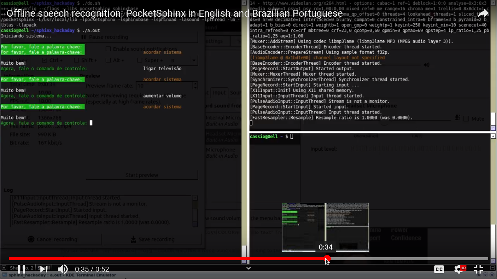

# TV Speech Remote Control

## Modules

- PocketSphinx running on ARM embedded Linux + USB mic
- Android app as mic accessing the above system via Bluetooth

## Sentences

    012                    012      9 
    ligar televisão        turn tv on
    desligar televisão     turn tv off
    aumentar volume        increase volume
    diminuir volume        decrease volume
    próximo canal          next channel
    canal anterior         previous channel
    mudar pro inglês       switch to portuguese

## Demonstration 

